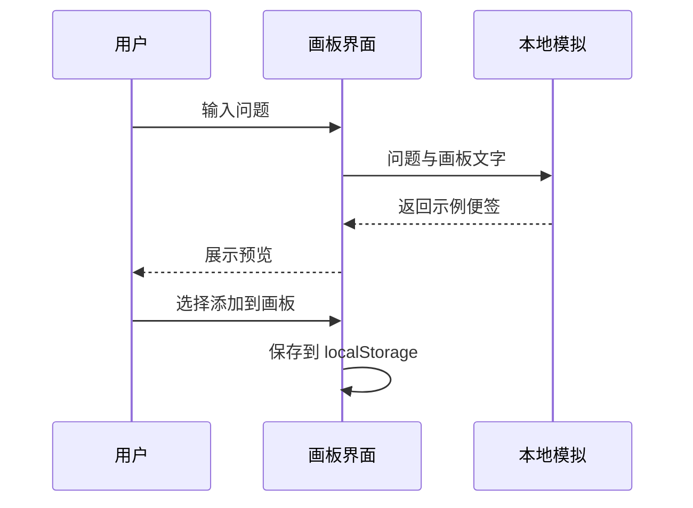

以“根据当前画板，整理三个创意方向”为例：

```mermaid
sequenceDiagram
  participant U as 用户
  participant W as 画板界面
  participant D as 本地模拟
  U->>W: 输入问题
  W->>D: 问题与画板文字
  D-->>W: 返回示例便签
  W-->>U: 展示预览
  U->>W: 选择添加到画板
  W->>W: 保存到 localStorage
```

## 上下文范围

开启画板引用时，演示逻辑使用已有文字整理示例。关闭引用后，仅围绕当前问题生成内容。全过程在浏览器内完成，不发送网络请求。

## 取消与恢复

生成过程中可以停止，原问题会恢复为草稿。刷新后恢复已有对话与未发送内容。建议只在用户点击添加后写入画板。
